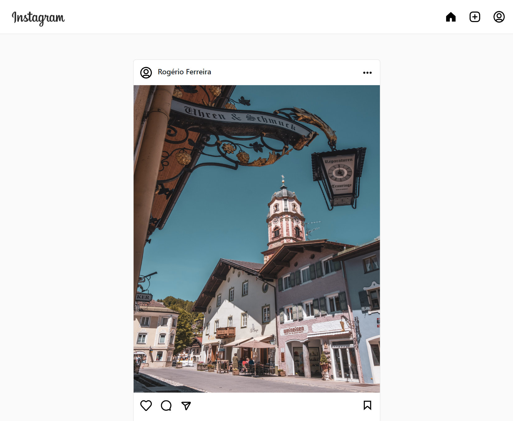

<h1 align="center">:three: Instagram Clone :camera:</h1>

  <a href="https://rogeriofrsouza.github.io/app3-instagram-clone/" target="_blank">Page</a>&nbsp;&nbsp;&nbsp;|&nbsp;&nbsp;&nbsp;
  <a href="#-tech-stack">Tech Stack</a>&nbsp;&nbsp;&nbsp;|&nbsp;&nbsp;&nbsp;
  <a href="#-project">Project</a>&nbsp;&nbsp;&nbsp;|&nbsp;&nbsp;&nbsp;
  <a href="#-layout">Layout</a>&nbsp;&nbsp;&nbsp;|&nbsp;&nbsp;&nbsp;
  <a href="#-license">License</a>

  

 

## 🚀 Tech Stack

This project was developed using these technologies:

- 
  &nbsp;Angular
- 
  &nbsp;Bootstrap
- 
  &nbsp;Firebase

Libraries:

- [Angular Fire](https://github.com/angular/angularfire)

Utilities:

- [Unsplash](https://unsplash.com/)
- [ng-bootstrap](https://github.com/ng-bootstrap/ng-bootstrap)

 

## 💻 Project

- This is a project clone of Instagram design, it's **Responsive** and store data in Firebase Database.
- It was further developed by me after the course dropped it, but stil has some features from original Instagram site.
- 3rd application developed in **Desenvolvimento WEB com JavaScript, TypeScript e Angular**. You can check the full course [here](https://www.udemy.com/course/curso-de-desenvolvimento-web-com-es6-typescript-e-angular-4/).

 

## 🔖 Layout

[Instagram](https://www.instagram.com/) 👾

 

## 📝 License

This project is under MIT License. You can check [LICENSE](https://github.com/rogeriofrsouza/app3-instagram-clone/blob/main/LICENSE) for more details.

 

---

Made with ♥ by Rogério :wave:
